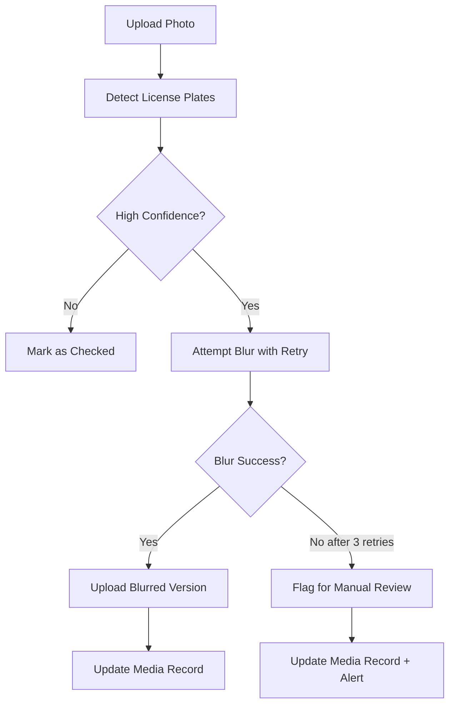

# License Plate Blur Retry Mechanism

## Overview

The license plate detection and blurring system includes automatic retry logic with exponential backoff to handle transient failures. When all retries fail, media is flagged for manual review.

## Retry Configuration

**Location:** `/src/app/api/listings/[id]/media/route.ts`

### Settings
- **Max Retries:** 3 attempts
- **Base Delay:** 1000ms (1 second)
- **Backoff Strategy:** Exponential
  - Attempt 1: 1 second delay
  - Attempt 2: 2 second delay
  - Attempt 3: 4 second delay

### Total Processing Time
- Best case (success on first try): ~0-2 seconds
- Worst case (3 failed retries): ~7 seconds (1s + 2s + 4s)

## How It Works

### 1. Media Upload Flow



### 2. Retry Logic

The retry mechanism is implemented using the `withRetrySafe` utility:

```typescript
const retryResult = await withRetrySafe(
  async () => {
    const blurResult = await blurLicensePlates(mediaUrl, plates)

    if (!blurResult.success || !blurResult.blurredBuffer) {
      throw new Error(blurResult.error || 'Blur operation failed')
    }

    return blurResult
  },
  {
    maxRetries: 3,
    baseDelay: 1000,
    onRetry: (attempt, error) => {
      console.log(`Retrying blur operation (attempt ${attempt}/3):`, error.message)
    },
  }
)
```

### 3. Database Schema

The `ListingMedia` model includes a `needsManualReview` flag:

```prisma
model ListingMedia {
  // ... other fields

  licensePlateDetected Boolean @default(false)
  licensePlateBlurred  Boolean @default(false)
  plateDetectionData   Json?
  needsManualReview    Boolean @default(false) // NEW: Flagged when blur fails after retries
}
```

## Manual Review Workflow

### 1. Detecting Items Needing Review

**API Endpoint:** `GET /api/admin/media/needs-review`

**Query Parameters:**
- `page`: Page number (default: 1)
- `limit`: Items per page (default: 50, max: 100)

**Response:**
```json
{
  "media": [
    {
      "id": "media_123",
      "listingId": "listing_456",
      "publicUrl": "https://...",
      "licensePlateDetected": true,
      "licensePlateBlurred": false,
      "needsManualReview": true,
      "plateDetectionData": {...},
      "listing": {
        "title": "1987 Porsche 911",
        "seller": {...}
      }
    }
  ],
  "pagination": {
    "page": 1,
    "limit": 50,
    "totalCount": 15,
    "totalPages": 1,
    "hasNext": false,
    "hasPrev": false
  }
}
```

### 2. Resolving Manual Review

**API Endpoint:** `PATCH /api/admin/media/needs-review`

#### Option A: Approve Image As-Is
If the license plate is not clearly visible or doesn't need blurring:

```json
{
  "mediaId": "media_123",
  "action": "approve"
}
```

#### Option B: Upload Manually Blurred Version
If you manually blur the image and upload it:

```json
{
  "mediaId": "media_123",
  "action": "blur_manually",
  "blurredUrl": "https://r2.finds.ro/listings/abc/exterior-blurred.jpg"
}
```

#### Option C: Reject Image
If the image should not be used:

```json
{
  "mediaId": "media_123",
  "action": "reject"
}
```

### 3. Service Functions

Use the `media-review.service.ts` helpers for programmatic access:

```typescript
import { getMediaNeedingReview, getMediaReviewStats } from '@/services/media/media-review.service'
import { getContainer } from '@/lib/container'

const container = getContainer()

// Get items needing review
const result = await getMediaNeedingReview(container.prisma, {
  page: 1,
  limit: 50,
})

// Get statistics
const stats = await getMediaReviewStats(container.prisma)
console.log(`${stats.totalNeedingReview} items need review`)
```

## Monitoring & Alerts

### Log Messages

**Success after retry:**
```
Blurred image uploaded for media ${mediaId} after ${attempts} attempt(s): ${url}
```

**Failure requiring manual review:**
```
MANUAL REVIEW REQUIRED: License plate blur failed for media ${mediaId} in listing ${listingId}.
Error: ${error}. High-confidence plates detected: ${count}
```

### Database Queries

**Count of items needing review:**
```sql
SELECT COUNT(*) FROM listing_media WHERE needs_manual_review = true;
```

**Items needing review with listing details:**
```sql
SELECT
  lm.id,
  lm.listing_id,
  lm.public_url,
  l.title,
  l.seller_id,
  lm.created_at
FROM listing_media lm
JOIN listings l ON l.id = lm.listing_id
WHERE lm.needs_manual_review = true
ORDER BY lm.created_at DESC;
```

## Retry Utility API

The generic retry utility (`/src/utils/retry.ts`) can be used for other operations:

### withRetry (throws on failure)

```typescript
import { withRetry } from '@/utils/retry'

const result = await withRetry(
  async () => await riskyOperation(),
  {
    maxRetries: 3,
    baseDelay: 1000,
    onRetry: (attempt, error) => {
      console.log(`Retry attempt ${attempt}:`, error)
    },
    shouldRetry: (error) => {
      // Only retry on specific errors
      return error.message.includes('timeout')
    },
  }
)
```

### withRetrySafe (returns result object)

```typescript
import { withRetrySafe } from '@/utils/retry'

const result = await withRetrySafe(
  async () => await riskyOperation(),
  { maxRetries: 3, baseDelay: 1000 }
)

if (result.success) {
  console.log('Success:', result.value)
} else {
  console.error('Failed after', result.attempts, 'attempts:', result.error)
}
```

## Common Failure Scenarios

### 1. Network Timeouts
**Symptom:** Blur service takes too long to respond
**Resolution:** Retry usually succeeds on subsequent attempt

### 2. Image Processing Errors
**Symptom:** Sharp library fails to process certain image formats
**Resolution:** Manual review required; admin can convert and re-upload

### 3. R2 Upload Failures
**Symptom:** Blurred image created but upload fails
**Resolution:** Retry with fresh upload URL

### 4. API Rate Limits
**Symptom:** External blur service returns 429
**Resolution:** Exponential backoff helps; increase base delay if persistent

## Best Practices

### For Developers

1. **Always use retry for external services:** Network operations, AI services, storage uploads
2. **Set appropriate timeouts:** Don't let retries hang indefinitely
3. **Log retry attempts:** Include attempt number and error details
4. **Use shouldRetry predicate:** Don't retry on non-transient errors (401, 403, etc.)
5. **Monitor manual review queue:** Set up alerts when queue grows

### For Admins

1. **Check manual review queue daily:** `/api/admin/media/needs-review`
2. **Review plate detection data:** Stored in `plateDetectionData` JSON field
3. **Verify blur quality:** Check both original and blurred URLs
4. **Document rejection reasons:** Use audit logs for transparency

## Database Migration

To add the `needsManualReview` field to existing deployments:

```bash
# Generate migration
npm run db:migrate

# Or push directly (development)
npm run db:push
```

The migration will add:
```sql
ALTER TABLE listing_media
ADD COLUMN needs_manual_review BOOLEAN NOT NULL DEFAULT false;
```

## Testing

Run the retry utility tests:

```bash
npm test src/utils/retry.test.ts
```

Test coverage includes:
- Successful first attempt
- Retry with eventual success
- Max retries exhausted
- Exponential backoff timing
- shouldRetry predicate
- onRetry callbacks
- Error handling

## Future Enhancements

1. **Configurable retry settings:** Move to environment variables or admin panel
2. **Retry queue with background jobs:** Use Redis or database queue for async retries
3. **ML model improvements:** Reduce false positives to minimize manual review load
4. **Automated notifications:** Email/Slack alerts when manual review queue exceeds threshold
5. **Batch processing:** Admin tool to blur multiple images at once
6. **A/B testing:** Compare blur algorithms to find most reliable one
